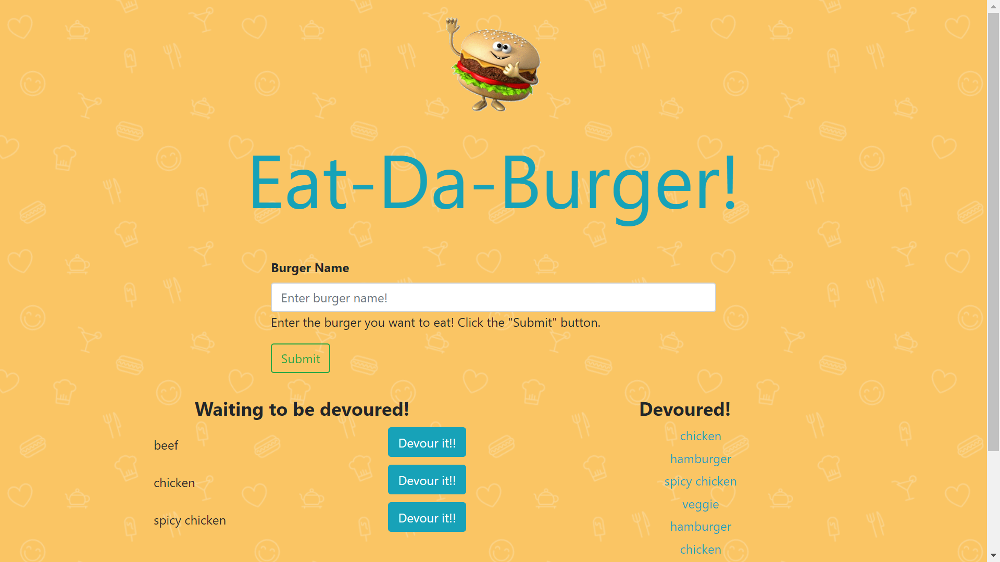

# burger

This is a burger logger app with MySQL, Node, Express, Handlebars and a homemade ORM!

**-------------------------------------------------------------------**

This application is base on MVC model. Following is the format for this app:

<pre>
-Burger\
    -config\
        -connection.js\
        -orm.js\
    -controllers
        -burgers_controller.js
    -db
        -schema.sql
        -seeds.sql
    -models
        -burger.js
    -public
        -assets
            -css
                -style.css
            -images
            -js
                -burgers.js
    -views
        -layouts
            -main.handlebars
        -partials
            -burgers
                -burgers-devour.handlebars
                -burgers-devoured.handlebars
            -index.hanldebars
    -server.js
</pre>
**-------------------------------------------------------------------**
        -
    